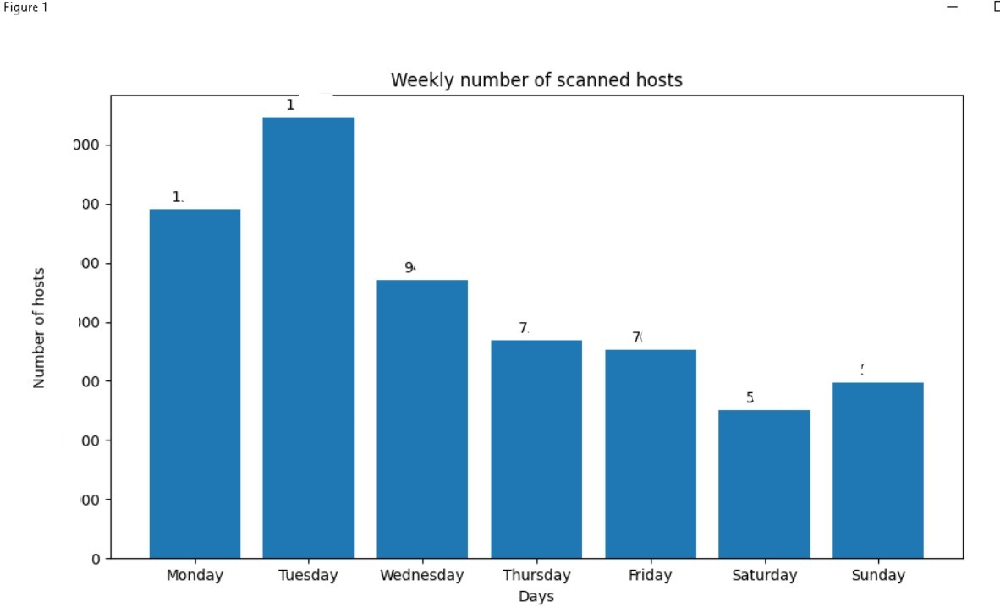

Export all schedules and save in the root of catalog with script. Use schedules.xml as the name of file.

```
python3 scheduleStatsMP.py
```



```
---------------------------------
Stats by schedules:
---------------------------------
Total:  100
Total quantity per week:  2xx
Monday: 49 - 20.8 %
Tuesday: 61 - 25.8 %
Wednesday: 36 - 15.3 %
Thursday: 27 - 11.4 %
Friday: 24 - 10.2 %
Saturday: 18 - 7.6 %
Sunday: 21 - 8.9 %
---------------------------------
---------------------------------
Weekly number of scanned hosts:
---------------------------------
Total quantity per week:  20000
Monday: 1xxx - 29.2 %
Tuesday: 1xxx - 36.9 %
Wednesday: 9xxx - 23.3 %
Thursday: 7xxx - 18.2 %
Friday: 7xx - 17.4 %
Saturday: 5xxx - 12.4 %
Sunday: 5xxx - 14.7 %
---------------------------------
```